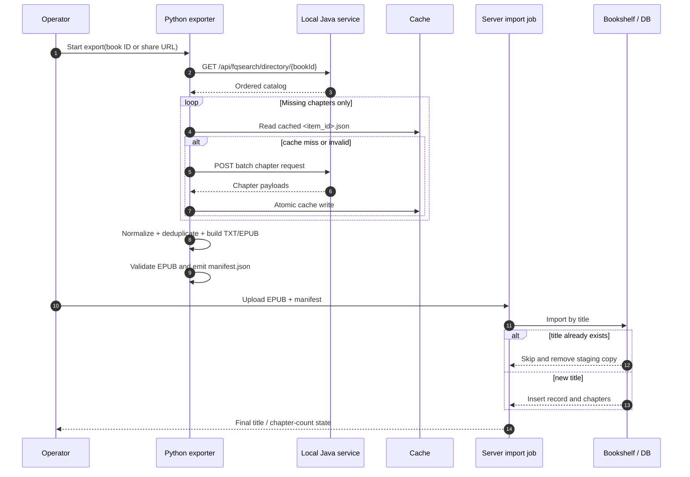

# Fanqie Novel Export Pipeline

中英双语入口：[`README.zh-CN.md`](README.zh-CN.md) · [`README.en.md`](README.en.md) · 正式流程报告：[`docs/2026-08-24_fanqie-export-pipeline-report.md`](docs/2026-08-24_fanqie-export-pipeline-report.md) · Release 草稿：[`docs/release-draft.zh-CN.md`](docs/release-draft.zh-CN.md) / [`docs/release-draft.en.md`](docs/release-draft.en.md)

这是一个可复现的“分享链接 → 目录 → 本地批量正文 → 去重 → TXT/EPUB → 校验 → manifest → 服务器幂等导入”流程。仓库只放流程代码、接口契约、配置模板和脱敏示例；小说正文、章节缓存、服务器数据库、Cookie、设备标识、注册密钥及 APK/SO 运行时资源均不入库。

## Pipeline at a glance


## Import handshake



更多 Mermaid 源文件见 [`docs/homepage-flow.mmd`](docs/homepage-flow.mmd) 与 [`docs/homepage-sequence.mmd`](docs/homepage-sequence.mmd)。

## Quick start

```bash
cd github-export-20260824
python3 -m venv .venv && . .venv/bin/activate
python -m pip install requests

# 1) Start the local Java service separately (see service/README.md).
# 2) Export by numeric ID or share URL; cache/output paths are ignored by Git.
python scripts/export_fanqie_reader.py '<book-id-or-share-url>' \
  --app-api http://127.0.0.1:9999 \
  --output-root outputs --cache-root cache

# 3) Build an import manifest for one output directory.
python scripts/make_manifest.py outputs/<channel>/<title> --channel '<channel>'
python scripts/validate_epub.py outputs/<channel>/<title>/<title>.epub
```

导入服务器时只复制 EPUB 和 `manifest.json`，使用 `scripts/upload_and_import.example.sh` 的环境变量契约；不要把真实主机、SSH 密钥或远程绝对路径写进仓库。

## Repository map

- `scripts/`：导出、内置 EPUB writer、EPUB 校验、manifest 和上传示例。
- `service/`：Spring Boot + Unidbg 本地签名/章节服务；运行时二进制资源需自行准备。
- `docs/`：数据流、架构、双语故障排查和正式流程报告。
- `examples/`：不含真实 ID/凭据的请求和 manifest 示例。
- `docs/release-draft.*.md`：可直接复制到 GitHub Release 的中英草稿说明。

## Configuration boundary

- Python：`FANQIE_APP_API`、`FANQIE_PUBLIC_USER_AGENT` 或 CLI 参数。
- Java：`FANQIE_API_*`、`FANQIE_DEVICE_*`、`FANQIE_REGISTRATION_KEY`；默认 `FANQIE_API_ENABLED=false`。
- 真实配置放在环境变量、密钥管理器或未跟踪 `application-local.yml`。提交前执行敏感扫描：

```bash
rg -n -I -S 'install_id|device_id|cdid|Cookie|Bearer|Authorization|registration-key|/Users/|/home/' .
```

扫描结果中的协议字段和占位符可以保留，真实值必须删除。

## Reproducibility notes

- 章节请求按 30 章分组串行发送，优先范围请求，失败回退显式 ID。
- 每个章节以 `<chapter-id>.json` 原子写入 cache，可中断后继续。
- 去重键是目录 `item_id`；标题必须与目录归一化匹配；正文过短会失败而不会生成半成品。
- EPUB 校验 ZIP CRC、未压缩 `mimetype`、容器文件和章节数。
- 服务导入按书名幂等：已存在的书应删除暂存副本并跳过，最终以数据库/书架状态核验。

## Troubleshooting

- `429 Too Many Requests`：等待退避，复用已有 cache；不要并行重试完整书籍。
- `ILLEGAL_ACCESS`：检查设备配置、上游会话和请求频率；不要把错误响应当正文。
- `empty response`：检查本地服务和运行时资源；只清理损坏批次的 cache。
- `EPUB CRC/mimetype`：重新生成该 EPUB，确认未被传输工具改写。

更多中文和英文细节见 [`README.zh-CN.md`](README.zh-CN.md) 与 [`README.en.md`](README.en.md)。发版时可直接参考 [`docs/release-draft.zh-CN.md`](docs/release-draft.zh-CN.md) 或 [`docs/release-draft.en.md`](docs/release-draft.en.md)。
