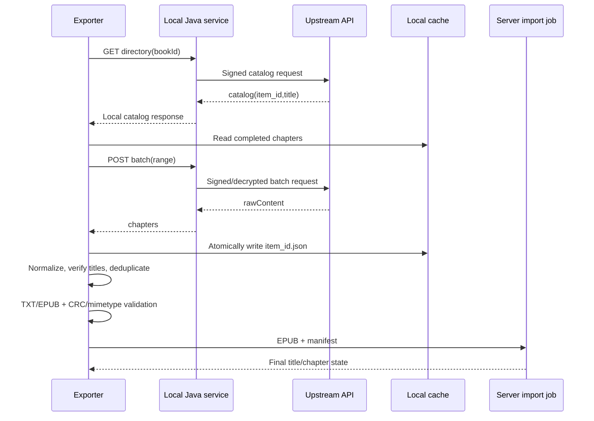

# Architecture (English)

The Java service owns the local API and decryption boundary. The exporter owns resumable state, deduplication, and file validation. The server import job owns final title-idempotent state. Runtime binaries and deployment secrets remain outside Git.
