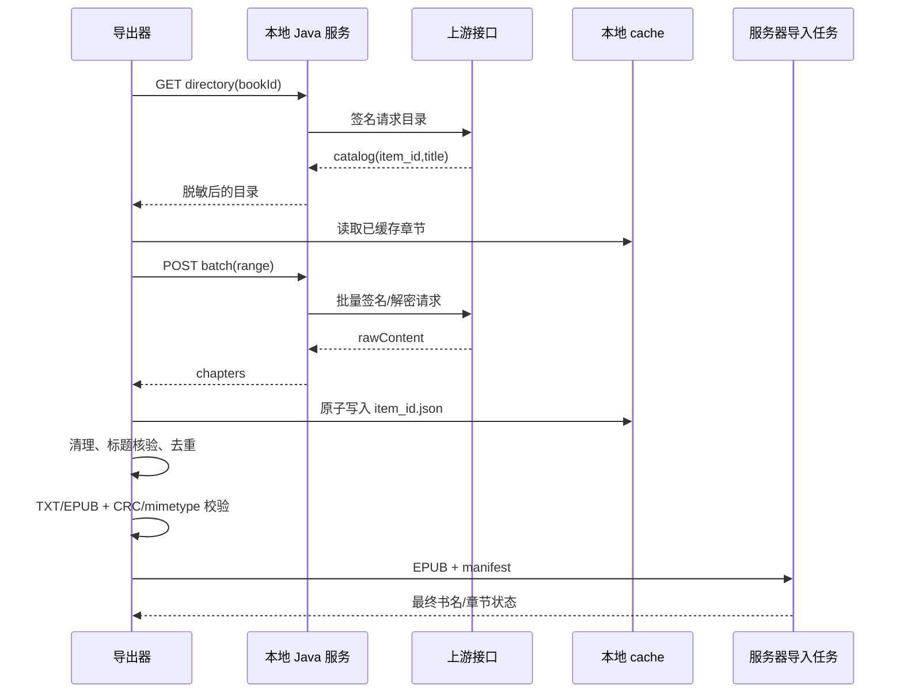

# 架构说明（中文）

```mermaid
sequenceDiagram
  participant U as 导出器
  participant S as 本地 Java 服务
  participant C as 上游接口
  participant K as 本地 cache
  participant I as 服务器导入任务

  U->>S: GET directory(bookId)
  S->>C: 签名请求目录
  C-->>S: catalog(item_id,title)
  S-->>U: 脱敏后的目录
  U->>K: 读取已缓存章节
  U->>S: POST batch(range)
  S->>C: 批量签名/解密请求
  C-->>S: rawContent
  S-->>U: chapters
  U->>K: 原子写入 item_id.json
  U->>U: 清理、标题核验、去重
  U->>U: TXT/EPUB + CRC/mimetype 校验
  U->>I: EPUB + manifest
  I-->>U: 最终书名/章节状态
```

边界：服务只负责本地 API 和解密；导出器负责状态、去重和文件验证；服务器导入任务负责最终幂等。二进制运行时资源和所有部署凭据在仓库外部管理。
